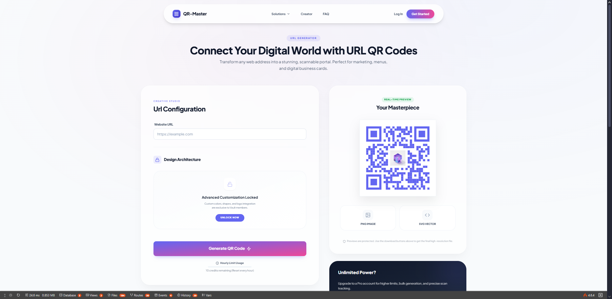

# 🎨 QR-Master | Premium QR Code Generator

[](https://webdevservices.in/qr/)
[](https://github.com/MrPawanMall)
[](LICENSE)

> **Transform standard black-and-white codes into vibrant, 3D branded experiences.**  
> Bridging the physical and digital worlds with premium QR solutions.

---

## ✨ Features

### 🎯 **Creative Studio**

- **AI-Powered Generation** - Create stunning QR codes instantly
- **Multiple Formats** - Export as JPG, PNG, or SVG
- **Real-time Preview** - See your QR code before downloading
- **Mobile Responsive** - Works flawlessly on all devices

### 🌈 **Aurora Engine Design**

- Premium glassmorphism UI
- Smooth gradient animations
- Modern dark theme
- Interactive hover effects

### 📊 **Dynamic Solutions**

| Feature              | Description                         |
| -------------------- | ----------------------------------- |
| 🌐 **Website URL**   | Direct link to any webpage          |
| 💬 **WhatsApp**      | Start chat with pre-written message |
| 📇 **vCard Profile** | Digital professional contact        |
| 📶 **Secure Wi-Fi**  | Instant network connectivity        |
| 📺 **YouTube Video** | One-scan video playback             |
| 🍎 **App Store**     | Link to App or Play Store           |
| 📧 **Fast Email**    | Pre-written email drafts            |
| 📍 **Maps Location** | Exact pin or address                |
| 📝 **Plain Text**    | Display any text message            |

---

## � Quick Start

### **Option 1: Direct Use**

Simply open `index.html` in your browser - no installation required!

### **Option 2: Clone & Run**

```bash
# Clone the repository
git clone https://github.com/MrPawanMall/QR-Master.git

# Navigate to the directory
cd QR-Master

# Open in browser
start index.html  # Windows
open index.html   # macOS
xdg-open index.html  # Linux
```

### **Option 3: Live Server**

```bash
# Using Python
python -m http.server 8000

# Using Node.js
npx serve

# Then visit: http://localhost:8000
```

---

## 🎨 Workflow: Three Steps to Magic

```
1️⃣ TARGET    → Select your destination (URL, WiFi, App Store, etc.)
2️⃣ DESIGN    → Choose your preferred format (JPG/PNG/SVG)
3️⃣ GENERATE  → Download your premium QR code instantly
```

---

## 🛠️ Tech Stack

- **HTML5** - Semantic structure
- **CSS3** - Modern styling with animations
- **Vanilla JavaScript** - No dependencies, pure performance
- **QR Server API** - Reliable QR code generation
- **Google Fonts** - Outfit & Inter typography

---

## 📸 Screenshots

### Creative Studio Dashboard



---

## 🌟 Key Highlights

- ✅ **Zero Dependencies** - Pure HTML, CSS, JavaScript
- ✅ **Lightweight** - Fast loading, optimized performance
- ✅ **SEO Optimized** - Proper meta tags and structure
- ✅ **Accessible** - WCAG compliant design
- ✅ **Cross-Browser** - Works on all modern browsers
- ✅ **Mobile First** - Responsive design approach

---

## 📁 Project Structure

```
QR-Master/
│
├── index.html      # Main landing page & QR generator
├── index.css       # Premium styling & animations
├── .gitignore      # Git ignore rules
└── README.md       # You are here!
```

---

## 🤝 Contributing

Contributions are welcome! Feel free to:

1. Fork the repository
2. Create your feature branch (`git checkout -b feature/AmazingFeature`)
3. Commit your changes (`git commit -m 'Add some AmazingFeature'`)
4. Push to the branch (`git push origin feature/AmazingFeature`)
5. Open a Pull Request

---

## � License

© 2026 QR-Master. A product of [WebDevServices](https://webdevservices.in).  
All Rights Reserved.

---

## 👨‍💻 Creator

**Pawan Mall**  
[](https://github.com/MrPawanMall)
[](https://webdevservices.in)

---

## 🔗 Links

- **Live Demo**: [https://webdevservices.in/qr/](https://webdevservices.in/qr/)
- **Repository**: [https://github.com/MrPawanMall/QR-Master](https://github.com/MrPawanMall/QR-Master)
- **Issues**: [Report a Bug](https://github.com/MrPawanMall/QR-Master/issues)

---

<div align="center">

### ⭐ Star this repo if you find it useful!

**Made with ❤️ by [MrPawanMall](https://github.com/MrPawanMall)**

</div>
